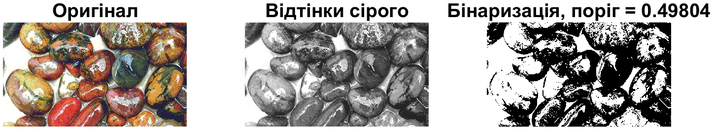
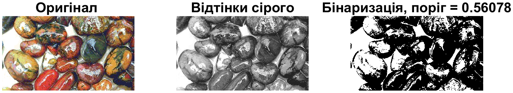
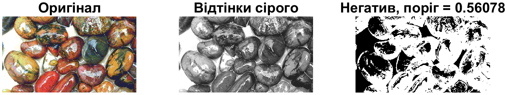
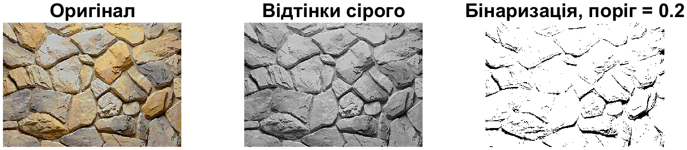
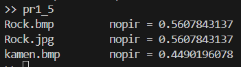

<div style="text-align:center; margin-top: 1cm;">
    <h2>Київський політехнічний інститут імені Ігоря Сікорського</h2>
    <h2>Приладобудівний факультет</h2>
    <h3>Кафедра автоматизації та систем неруйнівного контролю</h3>
    <br><br><br>
</div>

<div style="text-align:center; margin-top: 5cm;">
    <h2>Лабораторна робота № 1</h2>
    <h2>БІНАРИЗАЦІЯ ЗОБРАЖЕНЬ</h2>
</div>

<div style="text-align:right; margin-top: 5cm;">
<p>Студент: Погорєлов Богдан<br>
    Група: ПК-51мп<br>
</p>
</div>
<div style="text-align:center; margin-top: 5cm;">
2025 рік  <br><br><br><br>
</div>

# Мета роботи
Вивчення  засобів  по  бінаризації  зображення,  набуття  практичних  навичок  їх 
використання. Вивчити основи роботи з цифровими зображеннями в системі MatLab.

<div style="text-align:right;">
Таблиця 1.1
</div>

| Варіант | Формат вхідних зображень | Поріг |
| --| --- | ---|
| 12 | 1. Rock.bmp 2. Rock.jpg 3. Rock.bmp 4. kamen.bmp  | 0.2 |

1. Вивчити основні можливості системи MatLab по перетворенню кольорових зображень 
в бінарне. 
2.  Виконати бінаризацію зображень для вхідних форматів, що представлені в таблиці 1.1, 
згідно варіанту: 
1) Виконати бінаризацію палітрового зображення з використанням автоматичного порогу. 
2) Виконати бінаризацію кольорового зображення з використанням функції graythresh. 
3) Отримати негатив за допомогою бінаризації по порогу палітрового зображення. 
4) Виконати бінаризацію палітрового зображення з використанням заданого значення 
порогу. 
5) Обчислити поріг за допомогою функції graythresh для 1,2,3 вхідних зображень.

### Хід роботи:

### 1. Rock.bmp виконання бінаризації палітрового зображення з використанням автоматичного порогу.

Для виконання поставленої задачі було розроблено програму (лістинг 1), результат виконання зображений на рисунку 1.

<div style="text-align:right;">
Лістинг 1
</div>

``` matlab
[img, color_map] = imread('rock.bmp');
I = im2double(ind2gray(img, color_map));

level = DIYiterativeThreshold(I);
BW = I > level; % бінаризація

f = figure;
subplot(1,3,1), imshow(img, color_map), title('Оригінал');
subplot(1,3,2), imshow(I), title('Відтінки сірого');
subplot(1,3,3), imshow(BW), title(['Бінаризація, поріг = ', num2str(level)]);

function T = DIYiterativeThreshold(I)
  T = 0.5 * (min(I(:)) + max(I(:))); %початковий поріг - середнє між min max пікселів
  Tnext = 0;
  while abs(T - Tnext) >= 0.5
    Tnext = T;
    g = I >= T; %логічна маска "світлих" пікселів, які >= порогу
    T = 0.5 * (min(I(g)) + max(I(~g)));%- середнє між min світлих max темних пікселів
  end
end

```


<div style="text-align:center;">
Рис. 1 - Результ задачі 1
</div>


### 2. Rock.jpg виконання бінаризації кольорового зображення з використанням функції graythresh. 

Для виконання поставленої задачі було розроблено програму (лістинг 2), результат виконання зображений на рисунку 2.

<div style="text-align:right;">
Лістинг 2
</div>

``` matlab
img = imread('rock.jpg');

I =  im2double(rgb2gray(img));
level = graythresh(I); % Автоматичне визначення порогу методом Отсу
BW = imbinarize(I, level);

f = figure;
subplot(1,3,1), imshow(img), title('Оригінал');
subplot(1,3,2), imshow(I), title('Відтінки сірого');
subplot(1,3,3), imshow(BW), title(['Бінаризація, поріг = ', num2str(level)]);

exportgraphics(f, [mfilename('fullpath') '.png'], 'Resolution', 300);
```


<div style="text-align:center;">
Рис. 2 - Результ задачі 2
</div>

### 3. Rock.bmp отримання негативу за допомогою бінаризації по порогу палітрового зображення. 

Для виконання поставленої задачі було розроблено програму (лістинг 3), результат виконання зображений на рисунку 3.

<div style="text-align:right;">
Лістинг 3
</div>

``` matlab
[img, color_map] = imread('rock.bmp');
I = im2double(ind2gray(img, color_map));

level = graythresh(I);
BW = I < level; % бінаризація

f = figure;
subplot(1,3,1), imshow(img, color_map), title('Оригінал');
subplot(1,3,2), imshow(I), title('Відтінки сірого');
subplot(1,3,3), imshow(BW), title(['Негатив, поріг = ', num2str(level)]);

exportgraphics(f, [mfilename('fullpath') '.png'], 'Resolution', 300);
```


<div style="text-align:center;">
Рис. 3 - Результ задачі 3
</div>

### 4. kamen.bmp виконання бінаризації палітрового зображення з використанням заданого значення порогу (0.2).

Для виконання поставленої задачі було розроблено програму (лістинг 4), результат виконання зображений на рисунку 4.

<div style="text-align:right;">
Лістинг 4
</div>

``` matlab
[img, color_map] = imread('kamen.bmp');
I = im2double(ind2gray(img, color_map));

level = 0.2;
BW = I > level; % бінаризація

f = figure;
subplot(1,3,1), imshow(img, color_map), title('Оригінал');
subplot(1,3,2), imshow(I), title('Відтінки сірого');
subplot(1,3,3), imshow(BW), title(['Бінаризація, поріг = ', num2str(level)]);

exportgraphics(f, [mfilename('fullpath') '.png'], 'Resolution', 300);
```


<div style="text-align:center;">
Рис. 4 - Результ задачі 4
</div>

### 5. Обчислити поріг за допомогою функції graythresh для 1,2,3 вхідних зображень

Для виконання поставленої задачі було розроблено програму (лістинг 5), результат виконання зображений на рисунку 5.

<div style="text-align:right;">
Лістинг 5 
</div>

``` matlab
imgs = {'Rock.bmp', 'Rock.jpg', 'kamen.bmp'};

for k = 1:length(imgs)
    [X, map] = imread(imgs{k});
    if ~isempty(map)
        I = ind2gray(X, map); % якщо індексоване 
    else
        I = rgb2gray(X); % RGB або вже grayscale
    end
    gr = im2double(I);
    level = graythresh(I);  % поріг методом Отсу
    fprintf('%s \t поріг = %.10f\n', imgs{k}, level);
end
```



<div style="text-align:center;">
Рис. 5 - Результ задачі 5
</div>

## Висновок

У ході лабораторної роботи №1 була вивчена методика бінаризації зображень у середовищі MatLab. Було освоєно перетворення кольорових та палітрових зображень у відтінки сірого та подальшу бінаризацію з використанням різних методів визначення порогу:
* автоматичний поріг за допомогою власної функції (ітераційний метод);
* поріг за методом Отсу (graythresh);
* бінаризація з використанням заданого значення порогу;
* отримання негативу зображення через інверсію бінарної маски.

Практичні результати показали, що методи автоматичного визначення порогу дозволяють виділити об’єкти на зображенні без ручного підбору значень, тоді як встановлений поріг дає більший контроль над результатом. Робота дозволила закріпити знання з обробки цифрових зображень та практичне використання функцій MatLab для бінаризації.

### Контрольні запитання 

1. Як можна отримати бінарне зображення?  
   Бінарне зображення отримують шляхом порогового перетворення: кожен піксель зображення порівнюють із заданим порогом — пікселі, значення яких перевищує поріг, відображаються як 1 (білі), інші — як 0 (чорні).

2. Чим відрізняються глобальне і локальне порогове поділ?  
- Глобальний пороговий поділ використовує одне значення порогу для всього зображення.  
- Локальний пороговий поділ обчислює поріг для кожної області або вікна зображення окремо, що дозволяє краще виділяти об’єкти при нерівномірному освітленні.

3. Які функції використовуються для бінаризації зображення в системі MatLab?  
Основні функції:  
- `imbinarize` — бінаризація зображення за заданим порогом або методом Отсу;  
- `graythresh` — автоматичне обчислення порогу методом Отсу;  
- `im2bw` (старіша версія) — бінаризація за порогом;  
- власні алгоритми (наприклад, ітераційне обчислення порогу).

4. Що собою являє палітрове зображення?  
   Палітрове (індексоване) зображення — це зображення, у якому кольори представлені як індекси у палітрі (масив кольорів), а не безпосередньо у вигляді значень RGB.

5. Що собою являє напівтонове зображення?  
   Напівтонове зображення (grayscale) містить пікселі, що мають відтінки сірого, зазвичай від 0 (чорний) до 1 або 255 (білий), без кольорової інформації.

6. В яких межах може приймати значення порогу?  
Значення порогу залежить від формату зображення:  
- Для зображень у форматі `double` — від 0 до 1;  
- Для зображень у форматі `uint8` — від 0 до 255.

7. За допомогою якої функції виконується обчислення порогу?  
   Поріг можна обчислити автоматично за допомогою функції `graythresh`, яка реалізує метод Отсу.

> Метод Отсу — це автоматичний метод обчислення порогу для бінаризації зображень.  
    Ідея методу полягає в тому, щоб знайти таке значення порогу, яке максимізує різницю між класами пікселів (світлі та темні) і мінімізує їх внутрішньокласову дисперсію.  
    Цей метод дозволяє виділити об’єкти на зображенні без ручного підбору порогу.