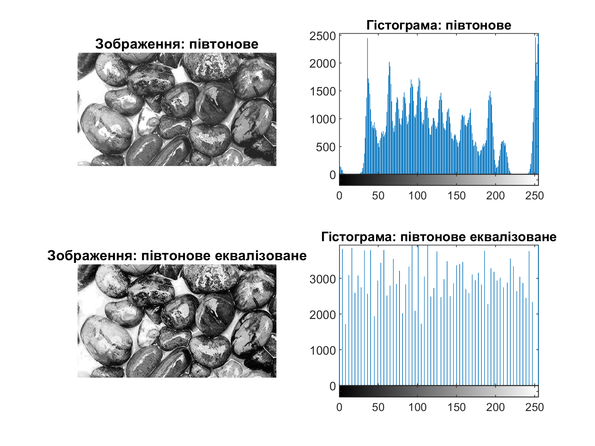
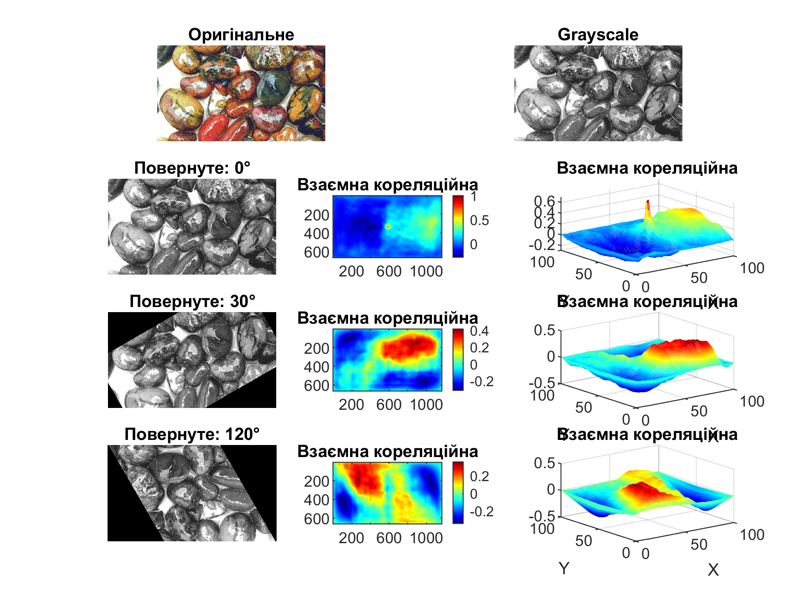
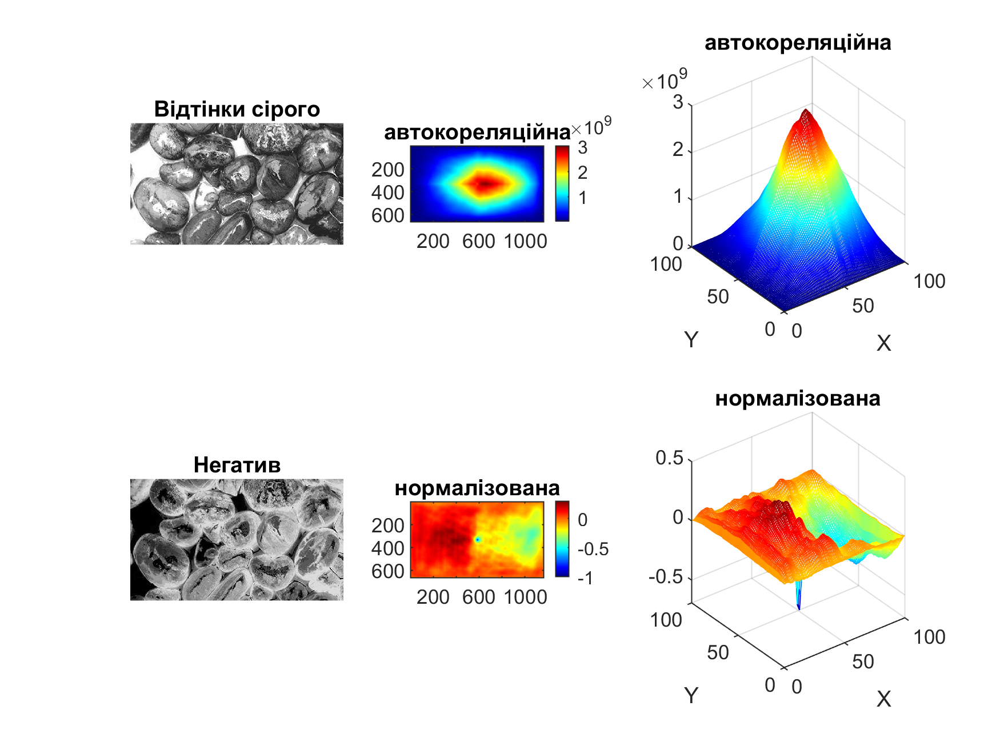

<div style="text-align:center; margin-top: 1cm;">
    <h2>Київський політехнічний інститут імені Ігоря Сікорського</h2>
    <h2>Приладобудівний факультет</h2>
    <h3>Кафедра автоматизації та систем неруйнівного контролю</h3>
    <br><br><br>
</div>

<div style="text-align:center; margin-top: 5cm;">
    <h2>Лабораторна робота № 2</h2>
    <h2>ФУНКЦІЇ, ЩО ВИКОРИСТОВУЮТЬСЯ ДЛЯ АНАЛІЗУ ЗОБРАЖЕНЬ</h2>
</div>

<div style="text-align:right; margin-top: 5cm;">
<p>Студент: Погорєлов Богдан<br>
    Група: ПК-51мп<br>
</p>
</div>
<div style="text-align:center; margin-top: 5cm;">
2025 рік  <br><br><br><br>
</div>

# Мета роботи
Вивчення  функцій  аналізу  зображень  та  придбання  практичних  навичок  їх 
використання.  Здобуття  практичних  навичок  побудови  гістограми  розподілу  яскравості 
зображення  в системі MatLab.

<div style="text-align:right;">
Таблиця 2.1

| Варіант | Формат вхідних зображень | Кут |
| --| --- | ---|
| 12 | 1. Rock.bmp 2. Rock.jpg 3 Rock.jpg  | 120,30,0 |
</div>

1. Отримати  півтонове  зображення  з  повнокольорового,  згідно  варіанту  таблиці  2.1,  1 
колонка  (1  формат  вхідних  зображень).  Еквалізувати    його.  Вивести  півтонове  та  
еквалізоване зображення та їх гістограми в одне вікно. 

2. Отримати  з  повнокольорового  зображення  згідно  варіанту табл.2.1,  (2)  палітрове. 
Зменшити кількість кольорів палітрового зображення до 256. Еквалізувати його. Вивести 
палітрове та еквалізоване зображення та їх гістограми в одне вікно. 

3. Знайти  двовимірну  взаємну  кореляційну  функцію  згідно  варіанту  табл.2.1  (3)    між 
вхідним  та  повернутим  на  кут    зображенням.  Графіки  отриманих  функцій  вивести  на 
екран в одне вікно. 

4. Знайти  двовимірну  взаємну  кореляційну  функцію  згідно  варіанту  табл.2.1  (3,)    між 
вхідним  зображенням та  його негативом.  Графіки отриманих функцій вивести на екран 
в одне вікно.

### Хід роботи:

### Крок 1. Побудова півтонового та еквалізованого зображень

1. Завантажено повнокольорове зображення у форматі **BMP**.
2. Перетворено його у півтонове за допомогою функції `rgb2gray`.
3. Виконано еквалізацію гістограми яскравості за допомогою функції `histeq`.
4. Виведено початкове півтонове та еквалізоване зображення разом з їх гістограмами в одне вікно.
5. Результат збережено у файл.

<div style="text-align:right;">
Лістинг 1
</div>

``` matlab
img = imread('rock.bmp');

g = rgb2gray(img);
eq = histeq(g); %вирівнювання (еквалізація) 

customHist({g, eq}, {'півтонове', 'півтонове еквалізоване'}, []);

print(gcf, [mfilename('fullpath') '.png'], '-dpng', '-r300');
close(gcf);
```


<div style="text-align:center;">
Рис. 1 - Результ задачі 1
</div>


### Крок 2. Побудова палітрового та еквалізованого палітрового зображення

1. Завантажено повнокольорове зображення.
2. Виконано перетворення у палітрове зображення з кількістю кольорів, обмеженою до **256** (`rgb2ind`).
3. Застосовано еквалізацію гістограми до отриманого зображення.
4. Виведено палітрове та еквалізоване палітрове зображення разом з їх гістограмами в одне вікно.
5. Результат збережено у файл.


<div style="text-align:right;">
Лістинг 2
</div>

``` matlab
img = imread('rock.bmp');

[pal, map] = rgb2ind(img, 256); %на палітрове з 256 кольорами
eq = histeq(pal);

customHist({pal, eq}, {'палітрове', 'еквалізоване палітрове'}, map);

print(gcf, [mfilename('fullpath') '.png'], '-dpng', '-r300');
close(gcf);

```


<div style="text-align:center;">
Рис. 2 - Результ задачі 2
</div>


### Крок 3. Кореляційний аналіз між оригінальним та повернутим зображенням

1. Завантажено зображення у форматі **JPG**.
2. Перетворено його у півтонове.
3. Виконано обертання зображення на кути, задані варіантом: **0°, 30°, 120°** (`imrotate`).
4. Обчислено двовимірну взаємну нормалізовану кореляційну функцію між вихідним та повернутим зображенням (`normxcorr2`).
5. Побудовано графіки обернених зображень та відповідних кореляційних функцій у вигляді як зображення, так і 3D mesh-графіка.
6. Результат збережено у файл.


<div style="text-align:right;">
Лістинг 3
</div>

``` matlab
img = imread('rock.jpg');
gray_img = rgb2gray(img);

angles = [0, 30, 120];
anglLen = length(angles)+1;

customPlot([anglLen, 2, 1], img, 'Оригінальне');
customPlot([anglLen, 2, 2], gray_img, 'Grayscale');

for k = 1:anglLen-1
    angle = angles(k);
    index = 3*k + 1;
    
    rotated_img = imrotate(gray_img, angle, 'bilinear', 'crop');
    c = normxcorr2(rotated_img, gray_img); % 2D нормалізована кореляція

    customPlot([anglLen, 3, index], rotated_img, ['Повернуте: ' num2str(angle) '°']);
    customPlot([anglLen, 3, index+1], c, 'Взаємна кореляційна');
    customMesh([anglLen, 3, index+2], c, 'Взаємна кореляційна');
end

drawnow;
print(gcf, [mfilename('fullpath') '.png'], '-dpng', '-r300');
close(gcf);
```


<div style="text-align:center;">
Рис. 3 - Результ задачі 3
</div>


### Крок 4. Кореляційний аналіз між оригінальним та негативним зображенням

1. Завантажено зображення у форматі **JPG**.
2. Перетворено його у півтонове.
3. Створено **негатив** зображення (`imcomplement`).
4. Обчислено дві кореляційні функції:
   * двовимірну автокореляційну функцію (`xcorr2`),
   * двовимірну нормалізовану взаємну кореляційну функцію (`normxcorr2`).
5. Побудовано графіки негативного та початкового зображення, а також отриманих функцій у вигляді зображень та 3D mesh-графіків.
6. Результат збережено у файл.


<div style="text-align:right;">
Лістинг 4
</div>

``` matlab
img = imread('rock.jpg');
gray_img = rgb2gray(img);
neg_img = imcomplement(gray_img);  % негатив

corr = xcorr2(neg_img, gray_img);  % 2D автокореляційна функція
coorN= normxcorr2(neg_img, gray_img); % 2D нормалізована кореляція

customPlot([2, 3, 1], gray_img, 'Відтінки сірого');
customPlot([2, 3, 2], corr,     'автокореляційна');
customMesh([2, 3, 3], corr,     'автокореляційна');
customPlot([2, 3, 4], neg_img,  'Негатив');
customPlot([2, 3, 5], coorN,    'нормалізована');
customMesh([2, 3, 6], coorN,    'нормалізована');

drawnow;
print(gcf, [mfilename('fullpath') '.png'], '-dpng', '-r300');
close(gcf);
```


<div style="text-align:center;">
Рис. 4 - Результ задачі 4
</div>


### Крок 5. Допоміжні функції

Для зручності побудови графіків і гістограм були реалізовані допоміжні функції:

* `customHist` – виведення зображень і їх гістограм;
* `customPlot` – відображення зображень і матриць у потрібному підграфіку;
* `customMesh` – побудова 3D-графіків (mesh) для великих матриць із зменшенням розміру для швидкості роботи.

<div style="text-align:right;">
Лістинг 5
</div>

``` matlab
function customHist(images, titles, map)
    for k = 1:length(images)
        img_k = images{k};
        t = titles{k};
        i = (k-1)*2;
        
        subplot(2,2,i+1);
        if isempty(map)
            imshow(img_k); 
        else
            imshow(img_k, map); 
        end
        title(['Зображення: ' t]);
        
        subplot(2,2,i+2); imhist(img_k);  title(['Гістограма: ' t]);
    end

    drawnow;
end
```
<div style="text-align:right;">
Лістинг 6
</div>

``` matlab
function customPlot(pos, im, t)
    ax = subplot(pos(1), pos(2), pos(3));
    
    if ~isa(im,'uint8') && ~isa(im,'uint16')  % якщо не клас зображення
        imagesc(ax, im); 
        axis(ax, 'image'); 
        colorbar(ax);
        colormap(ax, jet);  % кольорова карта для матриці
    else
        imshow(im, 'Parent', ax); 
        colormap(ax, gray);  % сірі відтінки для зображення
    end
    title(ax, t);
end
```

<div style="text-align:right;">
Лістинг 7
</div>

``` matlab
function customMesh(pos, c, t)
    max_size = 100; % максимальний розмір для mesh, бо ноуту погано :(
    [h, w] = size(c);

    row_idx = round(linspace(1, h, min(h,max_size)));
    col_idx = round(linspace(1, w, min(w,max_size)));
    c_small = c(row_idx, col_idx);
    
    ax = subplot(pos(1), pos(2), pos(3));
    mesh(ax, c_small);  
    title(ax, t); 
    xlabel(ax,'X'); ylabel(ax,'Y'); 
    % zlabel(ax, labelZ);
    colormap(ax, jet);
end
```

### Висновок

У ході лабораторної роботи було вивчено основні функції аналізу зображень у середовищі MatLab.
Отримано практичні навички перетворення зображень у півтонові та палітрові, виконано еквалізацію гістограм яскравості.
Досліджено взаємну кореляцію між оригінальними, повернутими та негативними зображеннями.
Практичне застосування дозволило закріпити знання щодо гістограм, еквалізації та методів кореляційного аналізу.

### Контрольні запитання 

1. Що таке гістограма?
   Розподіл яскравостей пікселів зображення у вигляді графіка.

2. Яка функція використовується для отримання гістограми?
   `imhist`.

3. У чому відмінність гістограми півтонового зображення від гістограми палітрового зображення?
   У півтоновому – відображає розподіл рівнів яскравості, у палітровому – залежить від кількості кольорів у палітрі.

4. Що таке еквалізація зображення?
   Вирівнювання гістограми для підвищення контрастності.

5. Яка функція виконує еквалізацію?
   `histeq`.

6. Назвіть способи виклику еквалізації.
   Використання функції `histeq` для півтонових і палітрових зображень.

7. У чому сенс кореляційного аналізу сигналів?
   У виявленні подібності та збігу між сигналами або зображеннями.

8. Які функції кореляційного аналізу ви знаєте?
   `xcorr2`, `normxcorr2`.