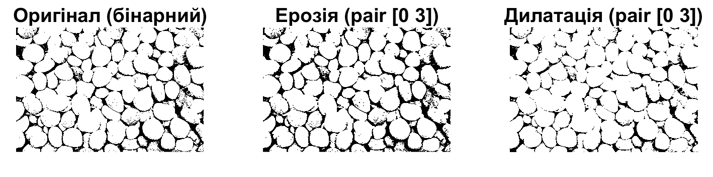
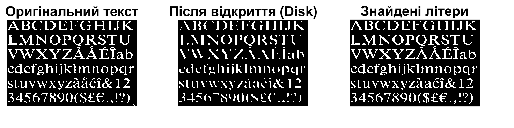
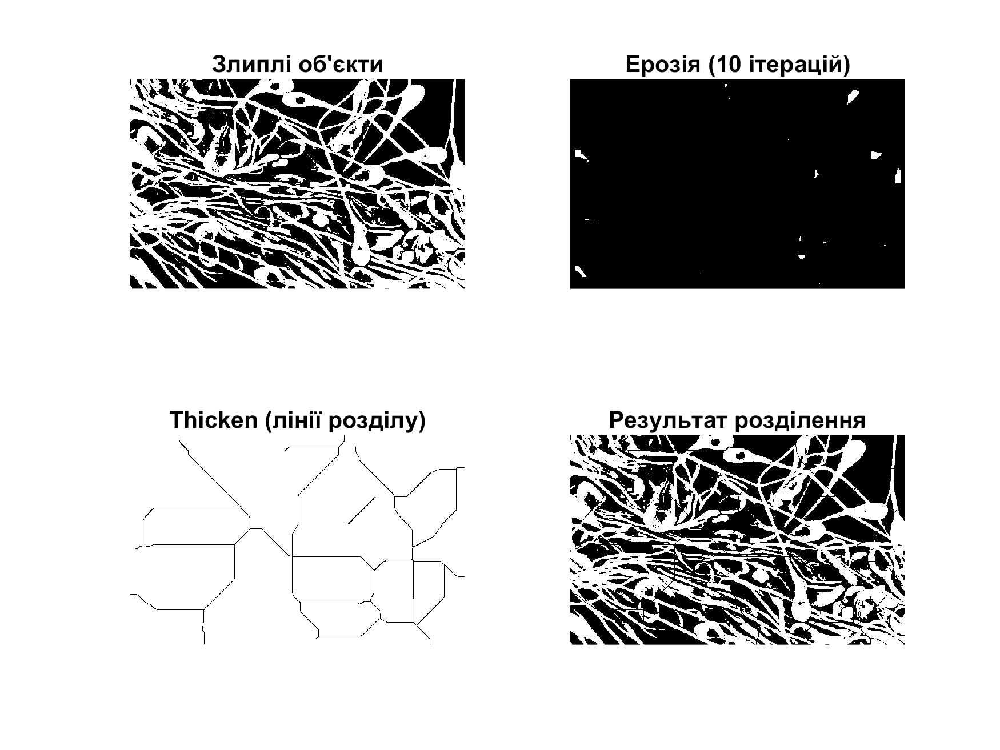

<div style="text-align:center; margin-top: 1cm;">
<h2>Київський політехнічний інститут імені Ігоря Сікорського</h2>
<h2>Приладобудівний факультет</h2>
<h3>Кафедра автоматизації та систем неруйнівного контролю</h3>
<br><br><br>
</div>

<div style="text-align:center; margin-top: 5cm;">
<h2>Лабораторна робота № 3</h2>
<h2>МОРФОЛОГІЧНІ ОПЕРАЦІЇ НАД БІНАРНИМИ ЗОБРАЖЕННЯМИ</h2>
</div>

<div style="text-align:right; margin-top: 5cm;">
<p>Студент: Погорєлов Богдан<br>
Група: ПК-51мп<br>
</p>
</div>
<div style="text-align:center; margin-top: 5cm;">
2025 рік  <br><br><br><br>
</div>

# Мета роботи

Вивчення морфологічних операцій та функцій по реалізації морфологічних операцій. Здобуття практичних навичок застосування морфологічних операцій над зображенням в системі MatLab.

<div style="text-align:right;">
Таблиця 3.1 (Варіант 12)

| Варіант | Вхідні дані (зображення) | Параметри | Форма фігури | Для склеювання |
| --| --- | --- | --- | --- |
| 12 | kamen1.jpg | [0 3] | Дві крапки | agglut.jpg |

</div>

1.  Знайти та видалити об'єкти на зображенні `kamen1.jpg` за допомогою ерозії, використовуючи форму «Дві крапки» з параметром зміщення `[0 3]`.
2.  Виконати дилатацію для того ж зображення з тими ж параметрами.
3.  Знайти в тексті з файлу `TextRoman.bmp` літери, у яких є круглі елементи.
4.  Розділити занадто злиплі об'єкти на зображенні `agglut.jpg` за допомогою морфологічних операцій.

### Хід роботи:

### Крок 1 та 2. Ерозія та Дилатація (Варіант 12)

1.  Завантажено зображення `kamen1.jpg`.
2.  Перетворено у бінарне (чорно-біле) за допомогою порогової обробки.
3.  Створено структурний елемент (SE) типу `pair` (дві крапки) зі зміщенням `[0 3]`, згідно з варіантом.
4.  Виконано операцію ерозії (`imerode`), яка звужує об'єкти, та операцію дилатації (`imdilate`), яка їх потовщує.
5.  Результати виведено в одне вікно.

<div style="text-align:right;">
Лістинг 1
</div>

```matlab
img = imread('kamen1.jpg');

% Перетворення у відтінки сірого, якщо потрібно
if size(img, 3) == 3
    gray_img = rgb2gray(img);
else
    gray_img = img;
end

% Бінаризація
level = graythresh(gray_img);
bw = imbinarize(gray_img, level);

% Створення структурного елемента: дві крапки, зміщення [0 3]
% Другий аргумент для 'pair' - це вектор зміщення [рядки, стовпці]
se = strel('pair', [0 3]);

% Виконання ерозії
bw_eroded = imerode(bw, se);

% Виконання дилатації
bw_dilated = imdilate(bw, se);

% Відображення результатів
figure('Name', 'Завдання 1 та 2', 'NumberTitle', 'off');

subplot(1, 3, 1);
imshow(bw);
title('Оригінал (бінарний)');

subplot(1, 3, 2);
imshow(bw_eroded);
title('Ерозія (pair [0 3])');

subplot(1, 3, 3);
imshow(bw_dilated);
title('Дилатація (pair [0 3])');

print(gcf, [mfilename('fullpath') '.png'], '-dpng', '-r300');
```

<div style="text-align:center;">
Рис. 1 - Результати ерозії та дилатації
</div>

### Крок 3. Пошук літер з круглими елементами

1.  Завантажено зображення `TextRoman.bmp`.
2.  Виконано бінаризацію.
3.  Застосовано операцію відкриття (opening) (`imopen`) зі структурним елементом у формі диска (`disk`). Це дозволяє залишити лише ті частини літер, в які "вписується" коло заданого радіусу.
4.  Використано морфологічну реконструкцію (`imreconstruct`), щоб відновити повну форму літер, які містили знайдені круглі елементи.

<div style="text-align:right;">
Лістинг 2
</div>

```matlab
img_text = imread('TextRoman.bmp');

% Бінаризація (інвертуємо, якщо текст чорний на білому)
bw_text = ~imbinarize(img_text); 

% Структурний елемент - диск
se_disk = strel('disk', 4);

% Відкриття: залишаються тільки об'єкти, де вміщується диск
bw_open = imopen(bw_text, se_disk);

% Реконструкція: відновлюємо повні літери за знайденими маркерами
bw_reconstructed = imreconstruct(bw_open, bw_text);

figure('Name', 'Завдання 3', 'NumberTitle', 'off');

subplot(1, 3, 1);
imshow(bw_text);
title('Оригінальний текст');

subplot(1, 3, 2);
imshow(bw_open);
title('Після відкриття (Disk)');

subplot(1, 3, 3);
imshow(bw_reconstructed);
title('Знайдені літери');

print(gcf, [mfilename('fullpath') '.png'], '-dpng', '-r300');
```

<div style="text-align:center;">
Рис. 2 - Пошук літер з круглими елементами
</div>

### Крок 4. Розділення злиплих об'єктів

1.  Завантажено зображення `agglut.jpg`.
2.  Виконано послідовну ерозію (`bwmorph(..., 'erode', n)`), щоб фізично розділити об'єкти, звузивши їх кордони.
3.  Знайдено остов фону за допомогою операції `'thicken'` до нескінченності. Це дозволяє знайти лінії розділення.
4.  Отримані лінії розділення накладено на оригінальне бінарне зображення через логічне "І" (`AND`), щоб отримати розділені об'єкти.

<div style="text-align:right;">
Лістинг 3
</div>

```matlab
img_agg = imread('agglut.jpg');

% Конвертація та бінаризація
if size(img_agg, 3) == 3
    img_agg = rgb2gray(img_agg);
end
level_agg = graythresh(img_agg);
bw_agg = im2bw(img_agg, level_agg);

% Кількість ітерацій ерозії підбирається, поки об'єкти не розлипнуться
n_iter = 10; 
bw_eroded_agg = bwmorph(bw_agg, 'erode', n_iter);

% "Потовщення" (thicken) для знаходження ліній розділу (skeleton of background)
bw_thick = bwmorph(bw_eroded_agg, 'thicken', inf);

% Розділення об'єктів: логічне AND початкового та потовщеного (розділового)
bw_separated = bw_agg & bw_thick; % Або (~bw_thick) залежно від полярності

figure('Name', 'Завдання 4', 'NumberTitle', 'off');

subplot(2, 2, 1);
imshow(bw_agg);
title('Злиплі об''єкти');

subplot(2, 2, 2);
imshow(bw_eroded_agg);
title(['Ерозія (', num2str(n_iter), ' ітерацій)']);

subplot(2, 2, 3);
imshow(bw_thick);
title('Thicken (лінії розділу)');

subplot(2, 2, 4);
imshow(bw_separated);
title('Результат розділення');

print(gcf, [mfilename('fullpath') '.png'], '-dpng', '-r300');
```

<div style="text-align:center;">
Рис. 3 - Розділення об'єктів
</div>

### Висновок

У ході лабораторної роботи було вивчено основні морфологічні операції обробки бінарних зображень у середовищі MatLab.
Згідно з варіантом 12, було досліджено роботу структурного елемента типу `pair` (дві крапки) для операцій ерозії та дилатації. Ерозія дозволила зменшити об'єкти, а дилатація — збільшити їх відповідно до заданого вектора зміщення.
Також було виконано завдання з пошуку об'єктів певної форми (круглих елементів у літерах) за допомогою комбінації відкриття та реконструкції.
Останнім етапом стало практичне застосування ерозії та потовщення для автоматичного розділення злиплих об'єктів на зображенні.

### Контрольні запитання

1.  Які логічні операції над бінарними зображеннями ви знаєте?
    AND (&), OR (|), NOT (\~), XOR, різниця множин.

2.  У чому призначення структуроутворюючого елементу в морфологічних операціях?
    Він визначає форму та розмір околиці пікселя, яка враховується при виконанні морфологічної операції (визначає, як саме буде трансформовано зображення) .

3.  Для чого використовуються морфологічні операції?
    Для попередньої обробки (фільтрація, спрощення), виділення структури об'єктів, отримання кількісних характеристик (площа, периметр), розділення об'єктів.

4.  Які морфологічні операції обробки зображення відносяться до базових?
    Ерозія (`imerode`) та дилатація (`imdilate`).

5.  Які операції є комбінуванням ерозії і дилатації?
    Розмикання (Opening) та замикання (Closing).

6.  Які функції пакета IPT виконують операції ерозії і дилатації, замикання, розмикання?
    `imerode`, `imdilate`, `imclose`, `imopen`.
