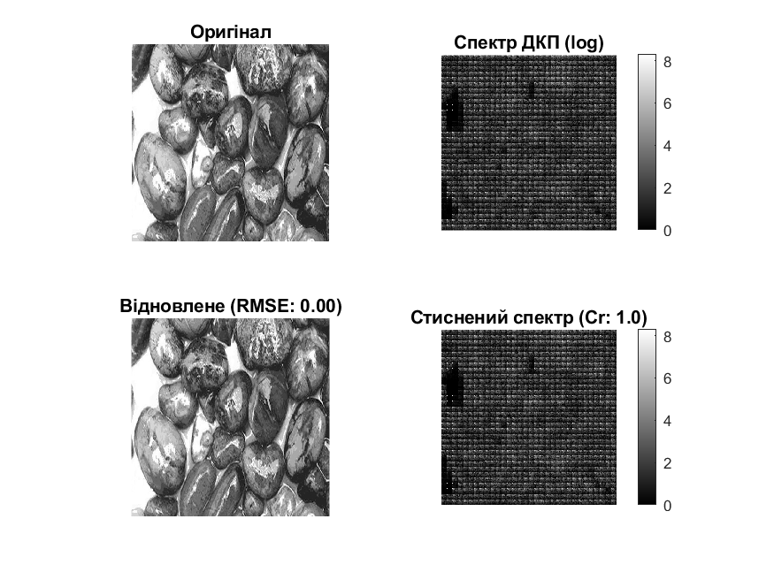
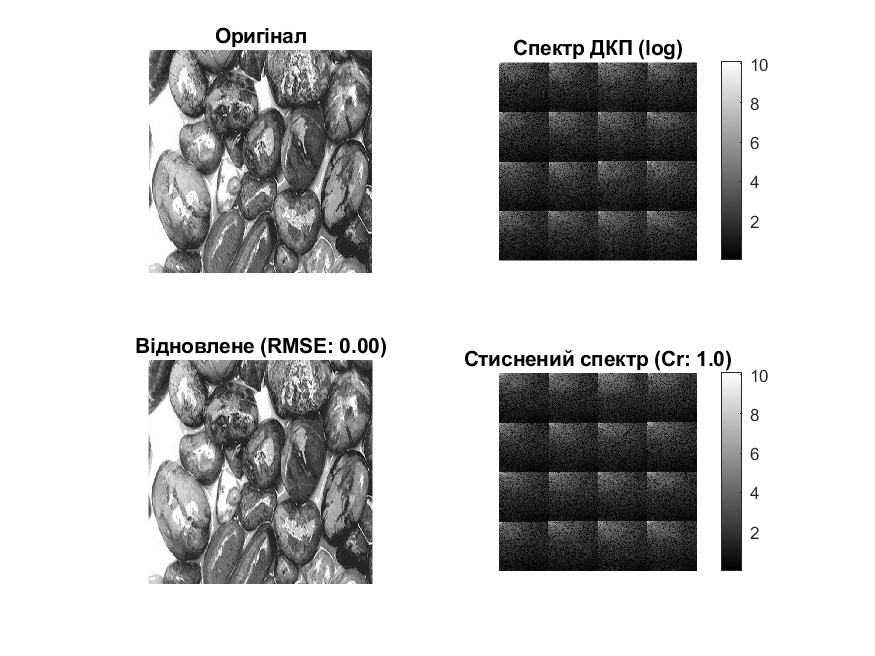
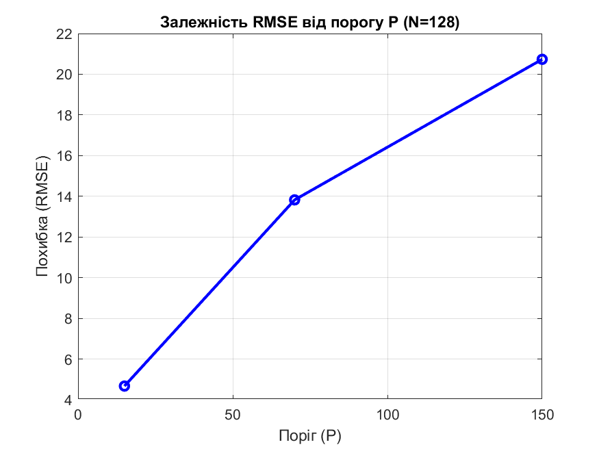
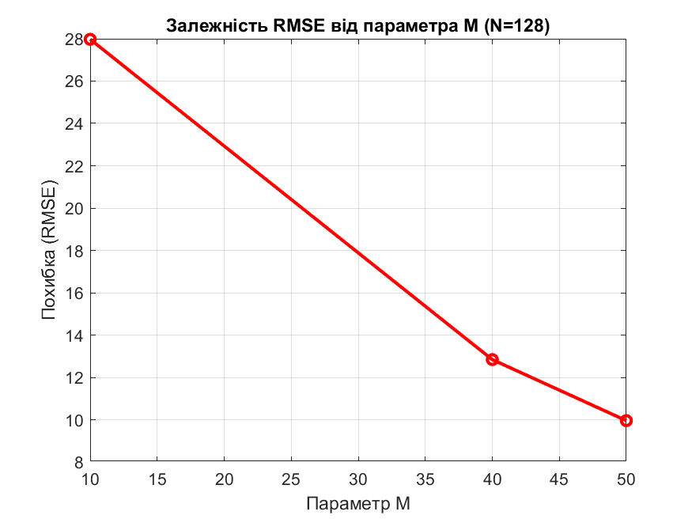
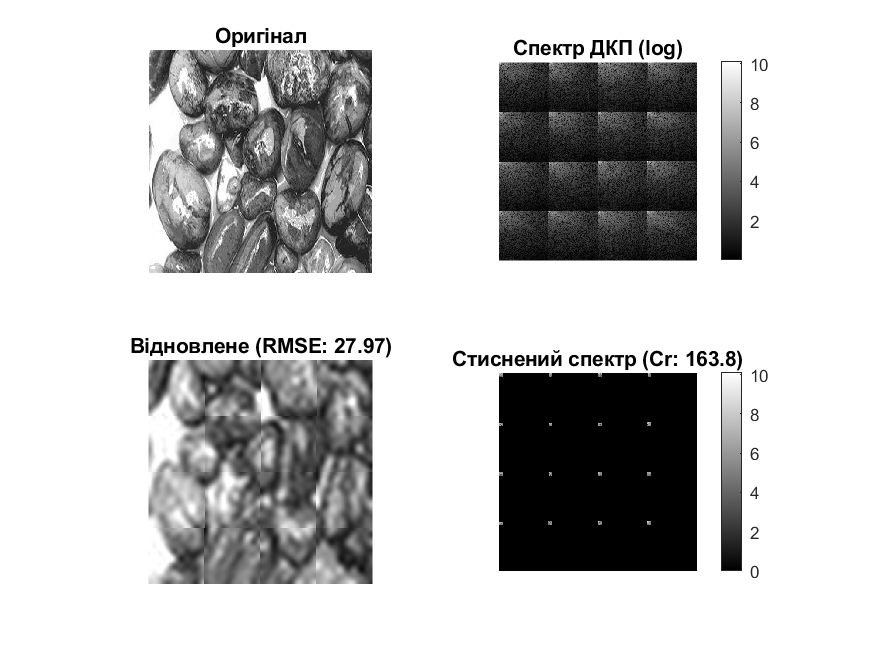

<div style="text-align:center; margin-top: 1cm;">
<h2>Київський політехнічний інститут імені Ігоря Сікорського</h2>
<h2>Приладобудівний факультет</h2>
<h3>Кафедра автоматизації та систем неруйнівного контролю</h3>
</div>

<div style="text-align:center; margin-top: 5cm;">
<h2>Лабораторна робота № 4</h2>
<h2>ДОСЛІДЖЕННЯ JPEG-АЛГОРИТМУ СТИСНЕННЯ ЦИФРОВИХ ВІДЕОЗОБРАЖЕНЬ</h2>
</div>

<div style="text-align:right; margin-top: 6cm;">
<p>Студент: Погорєлов Богдан
Група: ПК-51мп
</p>
</div><br><br>
<div style="text-align:center; margin-top: 6cm;">
2025 рік  
</div><br>

Мета роботи

Дослідити можливість стиснення цифрових відеозображень в процесі реєстрації візуальної інформації в СТЗ на прикладі JPEG-алгоритму. Визначити вплив параметрів алгоритму (розмір блоку, поріг квантування, кількість коефіцієнтів) на якість отриманих зображень.

Данні таблиці 4.1 (Варіант 12)

- Розмір зображення `512 \times 512`
- Розмір блоку ДКП (NxN) `16x16, 128x128`
- Поріг (P) `15, 70, 150`
- Кількість коефіцієнтів (M) `10, 40, 50`


Хід роботи:

### Крок 1. Реалізація алгоритму

Для виконання роботи було розроблено функцію jpeg_compress у середовищі MatLab, яка виконує:

Розбиття зображення на блоки `N \times N`.

Пряме дискретне косинусне перетворення (ДКП).

Обробку спектральних коефіцієнтів (порогова або зональна фільтрація).

Обернене ДКП та відновлення зображення.

Розрахунок похибок (RMSE) та коефіцієнта стиснення.

Використовувався матричний метод обчислення ДКП (dctmtx), оскільки він є більш швидкодіючим у середовищі MatLab порівняно з циклічним обчисленням сум.

### Крок 2. Дослідження впливу розміру блоку ДКП

Було проведено стиснення зображення при розмірах блоку 16x16 та 128x128.

Результати:


<div style="text-align:center;">Рис. 1 - Результат при N=16</div>


<div style="text-align:center;">Рис. 2 - Результат при N=128</div>

#### Аналіз:
При збільшенні розміру блоку `N` час обчислення зростає, оскільки складність ДКП залежить від розміру матриці. Однак, більші блоки дозволяють враховувати більш глобальні низькочастотні складові зображення. 

При `N=128` на відновленому зображенні можуть бути помітні артефакти на межах блоків ("блочність") меншою мірою, ніж при малих `N`, але обчислювальні затрати вищі.

### Крок 3. Дослідження впливу порогу (P)

Дослідження проводилось для блоку `N=128` та значень порогу `P = \{15, 70, 150\}`. Коефіцієнти ДКП, менші за поріг, занулялись.


<div style="text-align:center;">Рис. 3 - Графік залежності похибки від порогу P</div>

```
--- Дослідження порогу (P) при N=128 ---
|  P  | RMSE  | Compr |
|-----|-------|-------|
|  15 |  4.67 |  5.73 |
|  70 | 13.82 | 29.39 |
| 150 | 20.73 | 99.79 |
```


<div style="text-align:center;">Рис. 4 - Візуальний результат при максимальному порозі P=150</div>

####  Аналіз:
Зі збільшенням порогу `P` кількість відкинутих коефіцієнтів зростає, що призводить до:
- Підвищення коефіцієнта стиснення.
- Зростання середньоквадратичної похибки (RMSE).
- Появи візуальних викривлень (втрата деталей, розмиття).

### Крок 4. Дослідження зональної фільтрації (M)

Дослідження проводилось для блоку `N=128`. Зберігалась лише низькочастотна частина спектру розміром `M \times M`, де `M = \{10, 40, 50\}`.


<div style="text-align:center;">Рис. 5 - Графік залежності похибки від параметра M</div>


```
--- Дослідження зональної фільтрації (M) при N=128 ---
|  M  | RMSE  | Compr |
|-----|-------|-------|
|  10 | 27.97 | 163.84|
|  40 | 12.84 | 10.24 |
|  50 |  9.96 |  6.55 |
```


<div style="text-align:center;">Рис. 6 - Результат при жорсткому обмеженні спектру (M=10)</div>

#### Аналіз:
Параметр `M` визначає кількість збережених низькочастотних коефіцієнтів.

При малих `M` (наприклад, 10) стиснення максимальне, але зображення стає дуже розмитим, втрачаються всі дрібні деталі (високі частоти).

При збільшенні `M` якість відновлюється, а похибка падає.

### Висновок

У ході лабораторної роботи досліджено алгоритм JPEG-стиснення.

Встановлено, що JPEG базується на відкиданні високочастотних складових спектру зображення, до яких людське око менш чутливе.

Використання великих блоків ДКП (`128 * 128`) дозволяє досягти високого ступеня стиснення, але потребує більше ресурсів.

Поріг `P` є ефективним інструментом регулювання балансу між якістю та розміром файлу.

Зональна фільтрація (параметр `M`) демонструє, що основна енергія зображення зосереджена в низькочастотній області (лівий верхній кут спектру ДКП).

###  Контрольні запитання

Чому виникає необхідність в застосуванні стиснення?
Через великі обсяги відеоданих, які важко зберігати та передавати в реальному часі без зменшення їх розміру.

Основні етапи JPEG-алгоритму:
- Конвертація кольору (RGB -> YCbCr) та субдискретизація.
- Розбиття на блоки.
- Пряме ДКП.
- Квантування (відкидання частини інформації).
- Ентропійне кодування (RLE, Хаффман).

Результат застосування ДКП:
Перехід від просторового представлення яскравості до частотного (спектр), де енергія зосереджена в низьких частотах.

Як впливає стиснення на якість?
Оскільки JPEG — це стиснення з втратами, якість погіршується. З'являються артефакти блочності (blocking artifacts) та ефект Гіббса (дзвін) на різких переходах (ringing artifacts).

<div style="text-align:right;">
Лістинг 1 - Основний код програми
</div>

```matlab
% Скрипт для виконання Лабораторної роботи №4 (Варіант 12)
clc; clear; close all;

% --- НАЛАШТУВАННЯ ---
imageFile = 'rock.jpg';
K = 512; % Розмір за варіантом

%% ЗАВДАННЯ 2-3: Вплив розміру блоку (N)
fprintf('\n--- Дослідження розміру блоку (N) ---\n');
Ns = [16, 128];

for i = 1:length(Ns)
    N = Ns(i);
    fprintf('Обробка для N=%d... ', N);
    
    % Виклик функції (без фільтрації P=0, M=0)
    res = jpeg_compress(imageFile, K, N, 0, 0, true);
    
    fprintf('Час: %.4f с, Стиснення: %.2f разів, RMSE: %.2f\n', ...
        res.TimeDCT + res.TimeIDCT, res.RCompress, res.ErrorDCTSKO);
    
    % Збереження графіка
    saveas(gcf, sprintf('task2_N%d.png', N));
    
end

%% ЗАВДАННЯ 4: Вплив порогу (P)
% Примітка: Розмір блоку беремо другий за варіантом -> N = 128
N_task4 = 128;
Ps = [15, 70, 150];
errors_P = [];

fprintf('\n--- Дослідження порогу (P) при N=%d ---\n', N_task4);
fprintf('|  P  | RMSE  | Compr |\n');
fprintf('|-----|-------|-------|\n');

for i = 1:length(Ps)
    P = Ps(i);
    res = jpeg_compress(imageFile, K, N_task4, 0, P, true);
    
    errors_P(end+1) = res.ErrorDCTSKO;
    fprintf('| %3d | %5.2f | %5.2f |\n', P, res.ErrorDCTSKO, res.RCompress);
    
    saveas(gcf, sprintf('task4_P%d.png', P));
    
end

% Побудова графіка залежності похибки від P
figure('Name', 'Залежність похибки від P');
plot(Ps, errors_P, '-bo', 'LineWidth', 2);
grid on;
title(['Залежність RMSE від порогу P (N=' num2str(N_task4) ')']);
xlabel('Поріг (P)'); ylabel('Похибка (RMSE)');
saveas(gcf, 'graph_error_P.png');


%% ЗАВДАННЯ 5: Вплив кількості коефіцієнтів (M)
% Примітка: N = 128
Ms = [10, 40, 50];
errors_M = [];

fprintf('\n--- Дослідження зональної фільтрації (M) при N=%d ---\n', N_task4);
fprintf('|  M  | RMSE  | Compr |\n');
fprintf('|-----|-------|-------|\n');

for i = 1:length(Ms)
    M = Ms(i);
    res = jpeg_compress(imageFile, K, N_task4, M, 0, true);
    
    errors_M(end+1) = res.ErrorDCTSKO;
    fprintf('| %3d | %5.2f | %5.2f |\n', M, res.ErrorDCTSKO, res.RCompress);
    
    saveas(gcf, sprintf('task5_M%d.png', M));
    
end

% Побудова графіка залежності похибки від M
figure('Name', 'Залежність похибки від M');
plot(Ms, errors_M, '-ro', 'LineWidth', 2);
grid on;
title(['Залежність RMSE від параметра M (N=' num2str(N_task4) ')']);
xlabel('Параметр M'); ylabel('Похибка (RMSE)');
saveas(gcf, 'graph_error_M.png');

fprintf('\nРоботу завершено! Графіки збережено у поточній папці.\n');
```

<div style="text-align:right;">
Лістинг 2 - Функція конвертації в jpg
</div>

```matlab
function res = jpeg_compress(imageFile, K, N, M, P, showPlots)
% ВХІДНІ ПАРАМЕТРИ:
%   imageFile - (string/char) Шлях до файлу або матриця зображення.
%   K         - (int) Розмір зображення (KxK).
%   N         - (int) Розмір блоку ДКП (NxN).
%   M         - (int) Зональна фільтрація (розмір квадрата MxM), 0 - вимк.
%   P         - (int) Порогова фільтрація (значення порогу), 0 - вимк.
%   showPlots - (bool) true/false. Чи будувати графіки.
%
% ВИХІДНІ ДАНІ (структура res):
%   res.MeanError   - Середня абсолютна похибка.
%   res.ErrorDCTSKO - Середньоквадратична похибка (RMSE).
%   res.MaxError    - Максимальна похибка.
%   res.RCompress   - Коефіцієнт стиснення.
%   res.TimeDCT     - Час виконання прямого ДКП (сек).
%   res.TimeIDCT    - Час виконання оберненого ДКП (сек).
%   res.Settings    - Структура з параметрами, з якими запускалась функція (K, N, M, P).
%   res.OrigImage       - Оригінальне зображення.
%   res.CoefDCT         - Спектр ДКП.
%   res.CoefDCTCompress - Стиснений спектр.
%   res.RestoreImage    - Відновлене зображення.

    % --- 1. ПІДГОТОВКА ЗОБРАЖЕННЯ ---
    if ischar(imageFile) || isstring(imageFile)
        RGB = imread(imageFile);
    else
        RGB = imageFile;
    end

    if size(RGB, 3) == 3
        II = rgb2gray(RGB);
    else
        II = RGB;
    end
    
    II = imresize(II, [K, K]);
    OrigImage = double(II);

    % --- 2. ОБЧИСЛЕННЯ ДКП (Пряме) ---
    t_start = tic;
    
    T = dctmtx(N);
    dct_func = @(block_struct) T * block_struct.data * T';
    CoefDCT = blockproc(OrigImage, [N N], dct_func);
    
    t_dct = toc(t_start);

    % --- 3. СТИСНЕННЯ ---
    CoefDCTCompress = CoefDCT;

    % Метод 1: Порогова обробка (P)
    if P > 0
        CoefDCTCompress(abs(CoefDCTCompress) < P) = 0;
    end

    % Метод 2: Зональна фільтрація (M)
    if M > 0 && M < N
        blockMask = zeros(N, N);
        blockMask(1:M, 1:M) = 1;
        fullMask = repmat(blockMask, K/N, K/N);
        CoefDCTCompress = CoefDCTCompress .* fullMask;
    end

    % --- 4. ВІДНОВЛЕННЯ (Обернене) ---
    t_start = tic;
    
    idct_func = @(block_struct) T' * block_struct.data * T;
    RestoreImageRaw = blockproc(CoefDCTCompress, [N N], idct_func);
    RestoreImage = max(0, min(255, RestoreImageRaw));
    
    t_idct = toc(t_start);

    % --- 5. РОЗРАХУНОК МЕТРИК ---
    ErrorDCTArray = abs(RestoreImage - OrigImage);
    
    nonZero = nnz(CoefDCTCompress);
    if nonZero == 0
        RCompress = Inf;
    else
        RCompress = numel(CoefDCTCompress) / nonZero;
    end

    % --- 6. ФОРМУВАННЯ РЕЗУЛЬТАТУ ---
    res.MeanError = mean(ErrorDCTArray(:));
    res.ErrorDCTSKO = sqrt(mean(ErrorDCTArray(:).^2));
    res.MaxError = max(ErrorDCTArray(:));
    res.RCompress = RCompress;
    
    res.TimeDCT = t_dct;
    res.TimeIDCT = t_idct;
    
    % Зберігаємо вхідні налаштування для зручності аналізу
    res.SettingsK = K;
    res.SettingsN = N;
    res.SettingsM = M;
    res.SettingsP = P;

    % Зберігаємо матриці (закоментуйте, якщо економите пам'ять)
    res.OrigImage = OrigImage;
    res.CoefDCT = CoefDCT;
    res.CoefDCTCompress = CoefDCTCompress;
    res.RestoreImage = RestoreImage;

    % --- 7. ВІЗУАЛІЗАЦІЯ (Тільки якщо showPlots = true) ---
    if showPlots
        figure('Name', 'Результати стиснення JPEG', 'NumberTitle', 'off');
        colormap(gray(256));
        
        subplot(2,2,1); 
        imshow(uint8(OrigImage)); 
        title('Оригінал');
        
        subplot(2,2,2); 
        imshow(log(abs(CoefDCT)+1), []); 
        title('Спектр ДКП (log)'); colorbar;
        
        subplot(2,2,3); 
        imshow(uint8(RestoreImage)); 
        title(['Відновлене (RMSE: ' num2str(res.ErrorDCTSKO, '%.2f') ')']);
        
        subplot(2,2,4); 
        imshow(log(abs(CoefDCTCompress)+1), []); 
        title(['Стиснений спектр (Cr: ' num2str(res.RCompress, '%.1f') ')']); colorbar;
    end
end
```