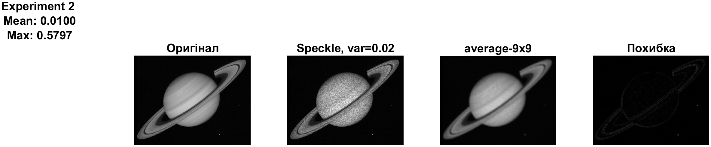

<div style="text-align:center; margin-top: 1cm;">
<h2>Київський політехнічний інститут імені Ігоря Сікорського</h2>
<h2>Приладобудівний факультет</h2>
<h3>Кафедра автоматизації та систем неруйнівного контролю</h3>
<br><br><br>
</div>

<div style="text-align:center; margin-top: 5cm;">
<h2>Лабораторна робота № 5</h2>
<h2>ДОСЛІДЖЕННЯ МЕТОДІВ ФІЛЬТРАЦІЇ ШУМІВ НА ЦИФРОВИХ ВІДЕОЗОБРАЖЕННЯХ</h2>
</div>

<div style="text-align:right; margin-top: 5cm;">
<p>Студент: Погорєлов Богдан<br>
Група: ПК-51мп<br>
</p>
</div>
<div style="text-align:center; margin-top: 5cm;">
2025 рік  <br><br><br><br>
</div>

# Мета роботи

Дослідити методи моделювання шумів, що мають місце на цифрових відеозображеннях, і методи фільтрації цих шумів. Розглянути стандартні функції пакету Image Processing Toolbox по моделюванню і фільтрації шумів.

<div style="text-align:right;">
Таблиця 5.1 (Варіант 12)
</div>

| Варіант | Тип шуму | Дисперсія | Розмір маски фільтра |
| --| --- | ---| ---|
| 12 | Мультиплікативний ("speckle") | 0.01; 0.02 | 1. 5x5 <br> 2. 9x9 |

Завдання:

1.  Розробити програму для автоматизованого проведення експериментів.
2.  Виконати моделювання шуму та фільтрацію усереднюючим фільтром (Average) та медіанним фільтром (Median) з параметрами згідно варіанту.
3.  Розрахувати похибки відновлення та візуалізувати їх разом із результатами на одному графіку.

### Хід роботи:

### 1. Налаштування параметрів та підготовка даних

Для виконання роботи було розроблено універсальний скрипт. У першій частині (Лістинг 1) виконується завантаження зображення, перетворення у формат `double` та ініціалізація масивів параметрів для 4-х експериментів.

<div style="text-align:right;">
Лістинг 1 (Ініціалізація)
</div>

```matlab
orig_img = imread('saturn.tif');
noise_type = 'speckle';
vars = [0.01, 0.02];
mask_sizes = [5, 9];

if ndims(orig_img) == 3
    orig_img = rgb2gray(orig_img);
end
I = im2double(orig_img);

% Налаштування параметрів для 4-х експериментів
idxList = 1:4;
vList = [vars(1), vars(2), vars(1), vars(2)];     
mList = [mask_sizes(1), mask_sizes(2), mask_sizes(1), mask_sizes(2)]; 

% Послідовність фільтрів: 2 рази Average, 2 рази Median
filterTypes = {'average', 'average', 'median', 'median'}; 
```

### 2. Реалізація циклу обробки та візуалізації

Основна частина програми (Лістинг 2) проходить по списку експериментів, генерує шум, обирає відповідний фільтр, розраховує похибки та зберігає результат у графічні файли.

<div style="text-align:right;">
Лістинг 2 (Цикл обробки)
</div>

```matlab
for i = 1:length(idxList)
    idx = idxList(i);
    v = vList(i);
    m = mList(i);
    currentFilter = filterTypes{i}; 
    noisy_I = imnoise(I, noise_type, v);
    if strcmp(currentFilter, 'average')
        h = fspecial('average', m);
        restored_I = imfilter(noisy_I, h);
    else
        restored_I = medfilt2(noisy_I, [m m]);
    end
    diff_I = abs(restored_I - I);
    err_mean = mean2(diff_I);
    err_max = max(max(diff_I));
    
    statsStr = sprintf('Experiment %d \nMean: %.4f\nMax: %.4f', idx, err_mean, err_max);
    figTitle = sprintf('Exp %d: %s %dx%d', idx, currentFilter, m, m);
    
    f = figure('Name', figTitle, 'NumberTitle', 'off');
    set(f, 'Position', [100, 100, 1000, 400]);

    splt(0, [], statsStr);
    splt(1, I, 'Оригінал');
    splt(2, noisy_I, ['Speckle, var=', num2str(v)]);
    splt(3, restored_I, [currentFilter, '-', num2str(m), 'x', num2str(m)]);
    splt(4, diff_I, 'Похибка');

    filename = [mfilename('fullpath'), '_', num2str(i), '.png'];
    exportgraphics(f, filename, 'Resolution', 300);
    close(f);
end
```

### 3. Допоміжна функція відображення

Для коректного вирівнювання текстової статистики та зображень було створено функцію `splt` (Лістинг 3).

<div style="text-align:right;">
Лістинг 3 (Функція splt)
</div>

```matlab
function splt(inx, I, title_str)
    subplot(1, 5, inx+1); imshow(I); title(title_str);
end
```

### Результати роботи програми:

#### Експеримент 1: Усереднюючий фільтр (Average), дисперсія 0.01, маска 5x5.


<div style="text-align:center;">
Рис. 1 - Результати експерименту №1
</div>

#### Експеримент 2: Усереднюючий фільтр (Average), дисперсія 0.02, маска 9x9.


<div style="text-align:center;">
Рис. 2 - Результати експерименту №2
</div>

#### Експеримент 3: Медіанний фільтр (Median), дисперсія 0.01, маска 5x5.


<div style="text-align:center;">
Рис. 3 - Результати експерименту №3
</div>

#### Експеримент 4: Медіанний фільтр (Median), дисперсія 0.02, маска 9x9.


<div style="text-align:center;">
Рис. 4 - Результати експерименту №4
</div>

## Висновок

У ході лабораторної роботи №5 було розроблено програмний код у середовищі MatLab для автоматизованого дослідження методів фільтрації мультиплікативного шуму ("speckle").

Аналіз отриманих результатів показав:

1.  Усереднюючий фільтр (Average): Ефективно придушує шум на однорідних ділянках, але при збільшенні розміру маски до 9x9 призводить до суттєвого розмиття меж об'єктів та втрати дрібних деталей.
2.  Медіанний фільтр: Демонструє кращі результати у збереженні різкості контурів (наприклад, кілець Сатурна), оскільки є нелінійним фільтром.
3.  Вплив параметрів: Збільшення дисперсії шуму очікувано погіршує якість відновлення. Збільшення апертури фільтра (з 5x5 до 9x9) зменшує середньоквадратичну похибку на фоні, але збільшує максимальну похибку на перепадах яскравості.

Автоматизація процесу дозволила швидко порівняти 4 різні конфігурації та отримати наочні графіки з числовими значеннями похибок.

### Контрольні запитання

1.  Які типи шумів можуть виникати в електронних схемах?
    Основні типи: тепловий шум (білий шум), дробовий шум, шум генерації-рекомбінації, флуктуаційні шуми.

2.  Поясніть принцип фільтрації шумів шляхом усереднення.
    Усереднюючий фільтр замінює значення яскравості центрального пікселя вікна на середнє арифметичне значення всіх пікселів у цьому вікні. Це працює як фільтр нижніх частот, згладжуючи різкі зміни.

3.  Як виконується медіанна фільтрація?
    Значення пікселів у вікні сортуються за зростанням, і центральний піксель замінюється на медіану (серединне значення) цього впорядкованого ряду. Це дозволяє ігнорувати екстремальні значення (імпульсний шум).

4.  Чому результат фільтрації не співпадає повністю з початковим зображенням?
    Фільтрація неминуче вносить спотворення: лінійні фільтри розмивають деталі, а нелінійні можуть видаляти дрібні структури або змінювати текстуру, оскільки неможливо ідеально відділити спектр корисного сигналу від спектру шуму.