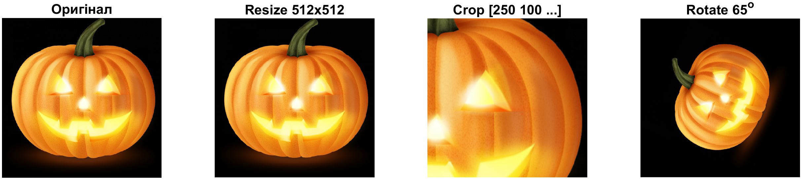

<div style="text-align:center; margin-top: 1cm;">
<h2>Київський політехнічний інститут імені Ігоря Сікорського</h2>
<h2>Приладобудівний факультет</h2>
<h3>Кафедра автоматизації та систем неруйнівного контролю</h3>
<br><br><br>
</div>

<div style="text-align:center; margin-top: 5cm;">
<h2>Лабораторна робота № 7</h2>
<h2>ГЕОМЕТРИЧНІ І ПРОСТОРОВІ ПЕРЕТВОРЕННЯ ЗОБРАЖЕНЬ</h2>
</div>

<div style="text-align:right; margin-top: 5cm;">
<p>Студент: Погорєлов Богдан<br>
Група: ПК-51мп<br>
</p>
</div>
<div style="text-align:center; margin-top: 5cm;">
2025 рік  <br><br><br><br>
</div>

# Мета роботи

Вивчити основні методи геометричних і просторових перетворень та дослідити можливість їх використання для обробки відеоінформації в системі MatLab.

<div style="text-align:right;">
Таблиця 7.1 (Варіант 12 - Геометричні перетворення)
</div>

| Параметр | Значення |
| :--- | :--- |
| Цільовий розмір | 512x512 |
| Межі прямокутника (imcrop) | `[250 100 250 250]` |
| Кут повороту | 65 градусів |

<div style="text-align:right;">
Таблиця 7.2 (Варіант 12 - Просторові перетворення)
</div>

| Параметр | Значення |
| :--- | :--- |
| Scale / Angle | `5.0 / 60 * pi *i / 180` |
| Stretch (Piecewise) | `1.2` |
| a1, a2 (Sinusoid) | `7,5` (згідно логіки таблиці: Var11=7,4; Var12=7.5 -> 7,5) |

### Хід роботи

### 1. Програмна реалізація

Розроблено скрипт (лістинг 1), який виконує дві групи перетворень: базові геометричні (зміна розміру, обрізка, поворот) та складні просторові (афінні, проекційні, поліноміальні, синусоїдальні).


### 2. Результати досліджень

#### Частина 1. Геометричні перетворення

На рис. 1 продемонстровано результати базових операцій.

  * Resize: Зображення приведено до формату 512x512 пікселів.
  * Crop: Вирізано область, починаючи з координати (250, 100) розміром 250x250.
  * Rotate: Зображення повернуто на 65 градусів проти годинникової стрілки. При повороті розмір полотна збільшився, щоб вмістити кути зображення (заповнення чорним).


<div style="text-align:center;">
Рис. 1 - Результати геометричних перетворень
</div>

#### Частина 2. Просторові перетворення

На рис. 2 показано результати застосування складних математичних перетворень координат.

  * Linear Conformal: Зображення масштабовано (коефіцієнт 5) та повернуто (60 градусів). Через великий коефіцієнт масштабування зображення значно збільшилось.
  * Affine: Застосовано зсув (shear) по одній з осей.
  * Projective: Зображення трансформовано так, ніби ми дивимось на нього під кутом (ефект перспективи).
  * Polynomial: Нелінійне викривлення зображення ("ефект лінзи" або вигину).
  * Piecewise Linear: Ліва частина зображення залишилась без змін, а права була розтягнута з коефіцієнтом 1.2.
  * Sinusoid: Застосовано хвилеподібне спотворення координат з амплітудами 7 та 5 пікселів.


<div style="text-align:center;">
Рис. 2 - Результати просторових перетворень
</div>

## Висновок

У ході лабораторної роботи №7 були вивчені та практично реалізовані методи геометричних та просторових перетворень зображень у середовищі MATLAB.

1.  Геометричні перетворення (`imresize`, `imcrop`, `imrotate`) дозволяють змінювати масштаб, кадрувати та орієнтувати зображення у просторі. Це базові операції для попередньої обробки даних у системах комп'ютерного зору (наприклад, для нормалізації розміру входу нейромережі).
2.  Просторові перетворення (`imtransform`, `tformarray`) базуються на зміні координат пікселів за певним законом (афінним, проекційним тощо).
      * Афінні перетворення зберігають паралельність ліній.
      * Проекційні перетворення моделюють перспективу.
      * Нелінійні (синусоїдальні, поліноміальні) дозволяють моделювати оптичні спотворення або створювати художні ефекти.

Виконання варіанту №12 показало, як параметри трансформаційної матриці `T` впливають на кінцевий вигляд об'єкта. Зокрема, високий коефіцієнт масштабування (scale=5) у лінійному конформному перетворенні вимагає коректної обробки меж зображення, щоб об'єкт не виходив за межі кадру.

<div style="text-align:right;">
Лістинг 1
</div>

```matlab
I = imread('halloween.png'); 
I_resized = imresize(I, [512 512]);
rect = [250 100 250 250]; 
I_cropped = imcrop(I_resized, rect);

angle_geo = 65;
I_rotated = imrotate(I_resized, angle_geo, 'bicubic');

f1 = figure('Name', 'Lab 7 - Part 1: Geometric', 'Position', [100, 100, 1000, 400]);
subplot(1, 4, 1); imshow(I); title('Оригінал');
subplot(1, 4, 2); imshow(I_resized); title('Resize 512x512');
subplot(1, 4, 3); imshow(I_cropped); title('Crop [250 100 ...]');
subplot(1, 4, 4); imshow(I_rotated); title(['Rotate ' num2str(angle_geo) '^o']);

exportgraphics(f1, 'Lab7_Part1_Geometric.png', 'Resolution', 300);
close(f1);
%% 1. Оригінал

I_sp = imread('leaf.jpg');

scale_val = 5.0; 
angle_sp = 60 * pi / 180;
stretch_val = 1.2;
a1 = 7; 
a2 = 5;

f2 = figure('Name', 'Lab 7 - Part 2: Spatial', 'Position', [100, 100, 1200, 600]);

subplot(2, 4, 1); imshow(I_sp); title('Original Image');

%% 2. Linear Conformal (Scale + Rotation)
sc = scale_val * cos(angle_sp);
ss = scale_val * sin(angle_sp);
T_conf = [ sc -ss;
           ss  sc;
            0   0 ];
t_lc = maketform('affine', T_conf);

I_linconf = imtransform(I_sp, t_lc, 'FillValues', .3); 
subplot(2, 4, 2); imshow(I_linconf); title('Linear Conformal');

%% 3. Affine (Generic)
T_aff = [1 0.1; 1 1; 0 0]; % Базова матриця зсуву з прикладу
t_aff = maketform('affine', T_aff);
I_affine = imtransform(I_sp, t_aff, 'FillValues', .3);
subplot(2, 4, 3); imshow(I_affine); title('Affine (Shear)');

%% 4. Projective
T_proj = [1 0 0.008; 1 1 0.01; 0 0 1];
t_proj = maketform('projective', T_proj);
I_proj = imtransform(I_sp, t_proj, 'FillValues', .3);
subplot(2, 4, 4); imshow(I_proj); title('Projective');

%% 5. Polynomial
% Генерація базисних точок (випадкова деформація)
rng(12); % Фіксуємо seed
xybase = reshape(randn(12, 1), 6, 2);
t_poly = cp2tform(xybase, xybase, 'polynomial', 2);

T_poly_data = [0 0; 1 0; 0 1; 0.001 0; 0.02 0; 0.01 0];
t_poly.tdata = T_poly_data;
I_poly = imtransform(I_sp, t_poly, 'FillValues', .3);
subplot(2, 4, 5); imshow(I_poly); title('Polynomial');

%% 6. Piecewise Linear (Розтягнення правої частини)
imid = round(size(I_sp, 2) / 2);
I_left = I_sp(:, 1:imid, :); % Підтримка RGB
I_right = I_sp(:, imid+1:end, :);
% Обчислення нового розміру
new_width = round(stretch_val * imid);
size_right = [size(I_sp, 1), new_width];
I_right_str = imresize(I_right, size_right);
I_piecewise = [I_left I_right_str]; % Склеювання
subplot(2, 4, 6); imshow(I_piecewise); title('Piecewise Linear');

%% 7. Sinusoidal Transformation
[nrows, ncols, ~] = size(I_sp);
[xi, yi] = meshgrid(1:ncols, 1:nrows);
% Формула деформації
u = xi + a1 * sin(pi * xi / imid);
v = yi - a2 * sin(pi * yi / imid);
tmap_B = cat(3, u, v);
resamp = makeresampler('linear', 'fill');
% tformarray застосовує координатне відображення
I_sin = tformarray(I_sp, [], resamp, [2 1], [1 2], [], tmap_B, .3);
subplot(2, 4, 7); imshow(I_sin); title(['Sinusoid (a1=' num2str(a1) ')']);

exportgraphics(f2, 'Lab7_Part2_Spatial.png', 'Resolution', 300);
close(f2);
```


### Контрольні запитання

1.  З яких основних функцій складається геометричне перетворення?
    Основні функції: масштабування (`imresize`), поворот (`imrotate`), кадрування (`imcrop`) та загальні просторові перетворення (`imtransform`).

2.  Що являє собою просторове перетворення?
    Це переміщення пікселів вихідного зображення `(x, y)` у нові координати `(u, v)` за заданим математичним законом (матрицею перетворення або функцією), часто з використанням інтерполяції для визначення значень яскравості у нових точках.

3.  Прикладні області застосування.

      * Виправлення геометричних спотворень оптики (дисторсія).
      * Суміщення супутникових знімків (реєстрація зображень).
      * Нормалізація зображень для розпізнавання (вирівнювання обличчя, номерного знака).
      * Медична візуалізація (суміщення МРТ та КТ).

4.  Як впливає застосування параметрів на зображення?

      * Матриця перетворення `T` визначає характер змін (поворот, зсув, перспектива).
      * Метод інтерполяції (nearest, bilinear, bicubic) впливає на якість (різкість) результуючого зображення. Бікубічна інтерполяція дає кращу якість, але повільніша за метод найближчого сусіда.