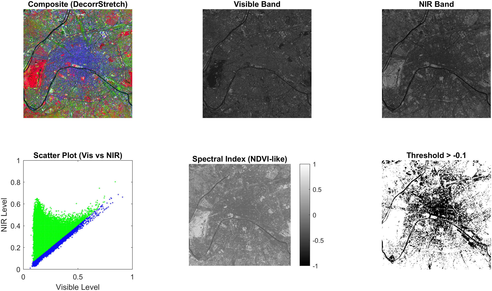

<div style="text-align:center; margin-top: 1cm;">
<h2>Київський політехнічний інститут імені Ігоря Сікорського</h2>
<h2>Приладобудівний факультет</h2>
<h3>Кафедра автоматизації та систем неруйнівного контролю</h3>
<br><br><br>
</div>

<div style="text-align:center; margin-top: 5cm;">
<h2>Лабораторна робота № 8</h2>
<h2>ПОШУК ОБ'ЄКТІВ НА МУЛЬТИ-СПЕКТРАЛЬНИХ ЗОБРАЖЕННЯХ</h2>
</div>

<div style="text-align:right; margin-top: 5cm;">
<p>Студент: Погорєлов Богдан<br>
Група: ПК-51мп<br>
</p>
</div>
<div style="text-align:center; margin-top: 5cm;">
2025 рік  <br><br><br><br>
</div>

# Мета роботи

Вивчити основні засоби та методи дистанційного зондування Землі (ДЗЗ). Дослідити можливість пошуку об'єктів (згідно з варіантом) на мультиспектральних зображеннях в системі MATLAB.

<div style="text-align:right;">
Таблиця 8.1 (Варіант 12)
</div>

| Варіант | Об'єкт пошуку | Зображення (рекомендоване) |
| :--- | :--- | :--- |
| 12 | Шляхи (дороги, мости, річки) | `tokyo.lan` |

Завдання:

1.  Завантажити мультиспектральне зображення `tokyo.lan`.
2.  Виконати покращення зображення методом декорреляційного розтягування.
3.  Виділити спектральні смуги (NIR - ближній інфрачервоний, Visible - видимий).
4.  Розрахувати індекс (аналог NDVI) для виділення урбанізованих ділянок та шляхів.
5.  Виконати порогову обробку для локалізації об'єкта.

### Хід роботи

### 1. Теоретична довідка

Мультиспектральні зображення містять дані у кількох діапазонах довжин хвиль. Для виділення шляхів та водної інфраструктури ефективно використовувати різницю у відбитті між інфрачервоним та видимим спектром. Вода та асфальт поглинають ІЧ-випромінювання сильніше, ніж рослинність, тому на індексних зображеннях вони матимуть від'ємні або низькі значення.

### 2. Програмна реалізація

Код розроблено на основі методичних вказівок (Додаток 1) та адаптовано для автоматичного збереження результатів.

<div style="text-align:right;">
Лістинг 1
</div>

```matlab

CIR = multibandread('paris.lan', [512, 512, 7], ...
    'uint8=>uint8', 128, 'bil', 'ieee-le', ...
    {'Band', 'Direct', [4 3 1]});

% --- 2. ПОПЕРЕДНЯ ОБРОБКА ---
% Декорреляційне розтягування для покращення кольорового сприйняття
decorrCIR = decorrstretch(CIR, 'Tol', 0.01);

% Виділення окремих каналів для аналізу
% NIR (Near Infrared) - Банд 4
NIR = im2single(CIR(:,:,1)); 
% Visible (Vis) - Банд 3 (використовуємо як опорний видимий канал)
Vis = im2single(CIR(:,:,2)); 

% --- 3. РОЗРАХУНОК СПЕКТРАЛЬНОГО ІНДЕКСУ ---
% Нормалізований різницевий індекс
% (NIR - Vis) / (NIR + Vis)
% Цей індекс дозволяє розділити воду/асфальт (темні) та рослинність (світлі)
index_img = (NIR - Vis) ./ (NIR + Vis);

% --- 4. ПОРОГОВА ОБРОБКА (ЛОКАЛІЗАЦІЯ ШЛЯХІВ) ---
% Експериментальний поріг для виділення шляхів та води
threshold = -0.1; 
binary_mask = (index_img > threshold); 

% --- 5. ВІЗУАЛІЗАЦІЯ ---
f = figure('Name', 'Lab 8: Remote Sensing - Paths Detection', ...
    'Position', [50, 50, 1200, 600], 'NumberTitle', 'off');

% 1. Композитне зображення (покращене)
subplot(2, 3, 1); imshow(decorrCIR); title('Composite (DecorrStretch)');

% 2. Видимий канал
subplot(2, 3, 2); imshow(Vis); title('Visible Band');

% 3. Інфрачервоний канал
subplot(2, 3, 3); imshow(NIR); title('NIR Band');

% 4. Scatter Plot (Діаграма розсіювання)
subplot(2, 3, 4);
plot(Vis(:), NIR(:), '+b', 'MarkerSize', 2); hold on;
% Виділяємо знайдені пікселі іншим кольором
plot(Vis(binary_mask), NIR(binary_mask), 'g+', 'MarkerSize', 2);
xlabel('Visible Level'); ylabel('NIR Level');
axis square; axis([0 1 0 1]);
title('Scatter Plot (Vis vs NIR)');

% 5. Індексне зображення
subplot(2, 3, 5); imshow(index_img, 'DisplayRange', [-1 1]); title('Spectral Index (NDVI-like)');
colorbar;

% 6. Результат сегментації (Маска)
subplot(2, 3, 6); imshow(binary_mask); title(['Threshold > ', num2str(threshold)]);

% Збереження результату
exportgraphics(f, [mfilename('fullpath') '_result.png'], 'Resolution', 300);
fprintf('Обробку завершено. Результат збережено.\n');
```

### 3. Результати досліджень

В результаті виконання програми отримано набір зображень, що ілюструють етапи обробки даних дистанційного зондування.


<div style="text-align:center;">
Рис. 1 Результаті
</div>

Аналіз результатів:

1.  Composite Image: Завдяки `decorrstretch` кольори стали більш насиченими, що дозволяє візуально відрізнити забудову (синюваті відтінки) від рослинності (червонуваті відтінки у псевдокольорах).
2.  Visible vs NIR: На каналі NIR вода та дороги виглядають значно темнішими, оскільки вони поглинають інфрачервоне світло. Рослинність, навпаки, яскраво відбиває NIR.
3.  Scatter Plot: Графік показує розподіл пікселів. Зеленим виділено пікселі, що потрапили у вибірку (шляхи, вода, будівлі) — вони зосереджені в області низьких значень NIR.
4.  Threshold Mask: Бінарне зображення чітко окреслює русло річки та основні транспортні магістралі міста Токіо, а також щільну забудову.

## Висновок

У ході лабораторної роботи №8 було розглянуто методи обробки мультиспектральних зображень для задач дистанційного зондування Землі.

Виконавши варіант №12 (пошук шляхів), я:

1.  Навчився працювати з форматом `.lan` та зчитувати окремі спектральні канали.
2.  Використав арифметичні операції над каналами (NIR та Visible) для розрахунку спектрального індексу.
3.  Встановив, що об'єкти інфраструктури (дороги) та вода мають схожі спектральні характеристики у діапазоні NIR (низьке відбиття), що дозволяє виділяти їх на фоні рослинності за допомогою порогової обробки.
4.  Експериментально підтвердив ефективність використання нормалізованих індексів для автоматизованої сегментації супутникових знімків.

### Контрольні запитання

1.  Що таке ДЗЗ?
    Дистанційне зондування Землі — це спостереження і вимір енергетичних характеристик випромінювання (власного або відбитого) елементів суші, океану і атмосфери без безпосереднього фізичного контакту з об'єктом.

2.  Для чого необхідно ДЗЗ?
    Для картографії, моніторингу навколишнього середовища, прогнозу погоди, сільського господарства (оцінка врожаю), військової розвідки та планування міської інфраструктури.

3.  Що таке мультиспектральне зображення?
    Це зображення, отримане шляхом одночасної зйомки однієї території у декількох вузьких спектральних діапазонах (наприклад, видимий, інфрачервоний, ультрафіолетовий).

4.  Що таке спектральна відбивна здатність?
    Це здатність об'єкта відбивати електромагнітне випромінювання різної довжини хвилі. Кожен матеріал має унікальну спектральну криву ("підпис").

5.  Назвіть основні частотні діапазони.
    Видимий (0.4-0.7 мкм), Ближній інфрачервоний (0.7-1.3 мкм), Середній ІЧ, Тепловий ІЧ, Мікрохвильовий (радіохвилі).